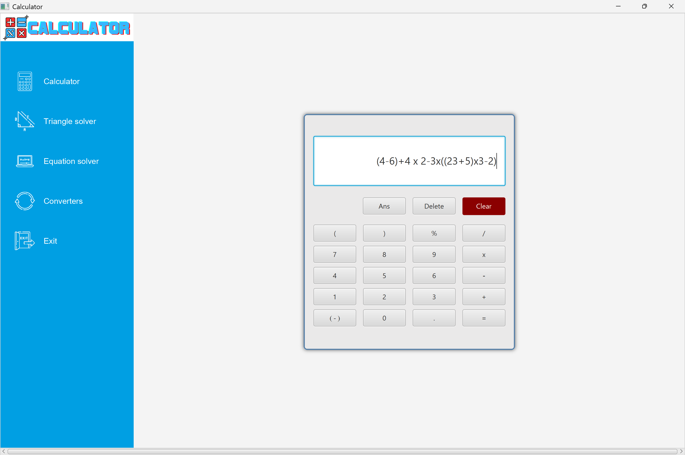
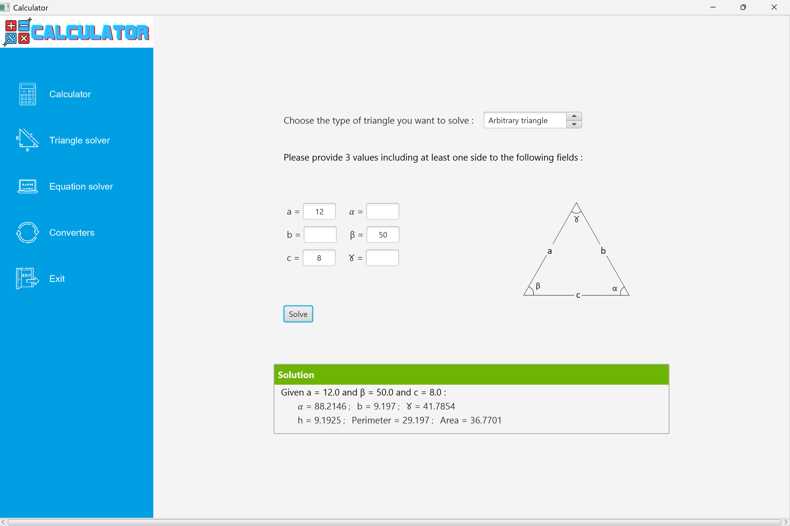
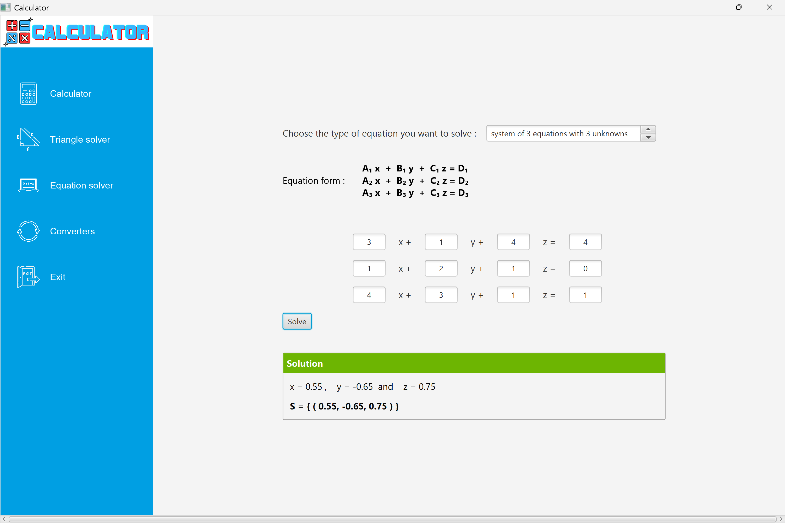
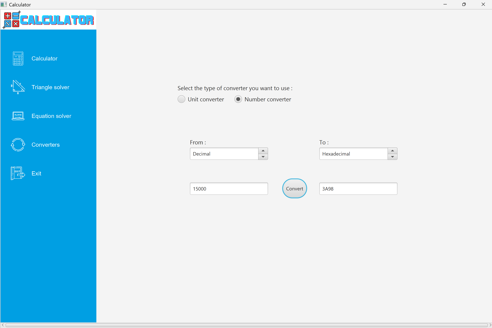
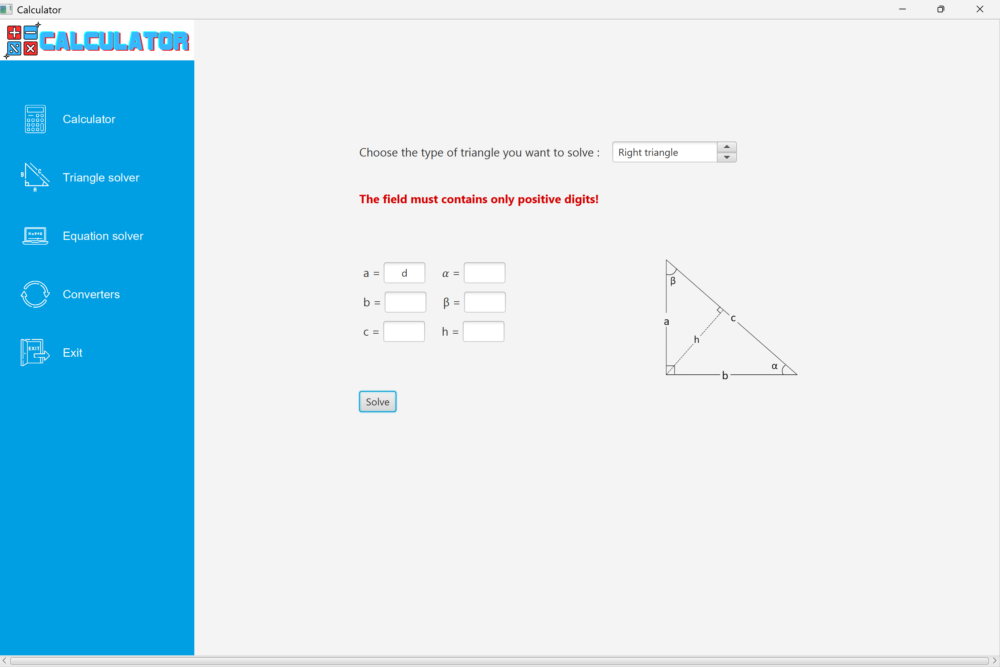
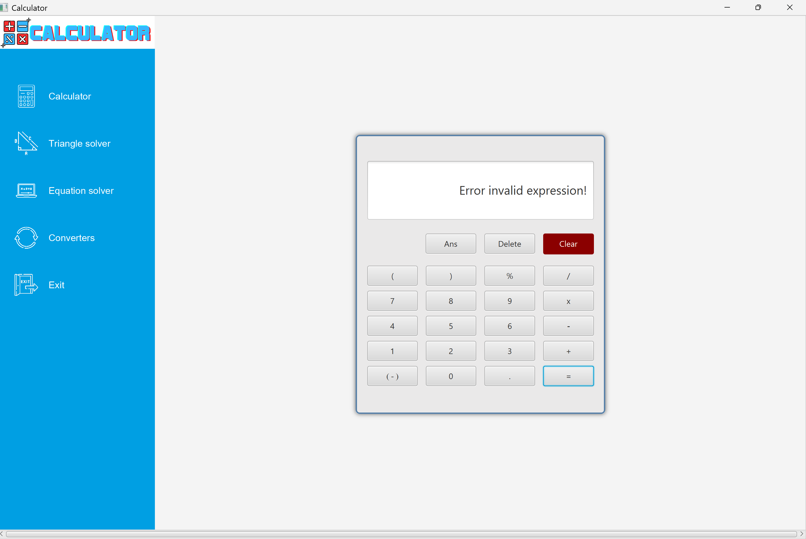

# 🧮 Advanced Calculator – Java / JavaFX
## 🧩 Description

This project is an advanced graphical calculator developed in Java using JavaFX.
In addition to standard arithmetic operations, it provides tools for geometry, algebra, equation solving, and unit conversions.

The application follows a layered architecture and the MVC pattern, applies SOLID principles, includes clean UI design with CSS, and is fully covered by JUnit unit tests.

## 🛠️ Technologies Used

- Java

- JavaFX

- CSS (JavaFX styling)

- JUnit 

- Maven 

- FXML (UI design)

## 🎨 User Interface & Design

- Modern and intuitive JavaFX interface

- Clear separation between calculation modes

- Custom CSS styling for:

  - Buttons

  - Input fields

  - Result display

- Visual feedback for errors and valid inputs

- User-friendly navigation between features

## 🏗️ Architecture
### Layers

- View: JavaFX UI and CSS styling

- Controller: User input handling

- Service: Mathematical and conversion logic

- Model: Mathematical structures and data

### MVC Pattern
Strict separation between UI, business logic, and data

## ➗ Features
- Basic Calculations
  - Addition
  - Subtraction
  - Multiplication 
  - Division
  - User
    Expression Parsing & Operator Precedence

- Users can directly enter mathematical expressions using the calculator input (display screen), for example:
(3 + 5) * 2 - 4 / 2

- Triangle Solving (Right & general triangle solving)

    - Side and angle calculations

    - Area and perimeter calculation

- Equation Solving

    - First-degree equations

    - Second-degree equations

    - Display of all solutions

- Systems of Equations

    - 2 equations with 2 unknowns

    - 3 equations with 3 unknowns

- Number & Unit Conversion

    - Number base conversion:

        - Binary
        - Decimal
        - Hexadecimal

- Unit conversion for angles

- The application correctly handles operator precedence:

    - Parentheses
    - Multiplication & division
    - Addition & subtraction

- Expression Tree (AST – Abstract Syntax Tree)

    - Mathematical expressions are parsed into an expression tree

    - Each node represents:

      - An operator (+, -, *, /)

      - Or an operand (number)

      - The expression tree ensures:

         - Correct evaluation order

         - Clean separation between parsing and evaluation logic

         - The tree-based approach improves:

             - Readability

             - Maintainability
    
             - Testability
    
             - Syntax Validation

             - User input is validated before evaluation

- Regular expressions are used to:

  - Validate allowed characters

  - Detect invalid operator sequences

  - Ensure correct parentheses usage

- Invalid expressions trigger:

  - Clear error messages

  - Visual feedback in the UI

- Error handling (division by zero, invalid input)

## 🧠 SOLID Principles

- Mathematical logic fully decoupled from UI

- Specialized, testable services

- Easy extensibility (scientific calculator features)

## 🧪 Unit Testing

- JUnit tests cover:
    - Arithmetic operations 
    - Operation priority
    - Triangle solving 
    - Equation solving (1st and 2nd degree)
    - Systems of equations 
    - Unit and number conversions 
    - Edge cases and error handling
  
```bash
# Execute this in the root of the code (./calculator)
mvn test
```

## 📸 Application preview
### Calculator


### Triangle solver


### Equation solver


### Number conversion


### User feedback


### Expression validation


### Operation validation


## 🚀 Run the Application
```bash
# Execute this in the root of the code (./calculator)
mvn javafx:run
```

